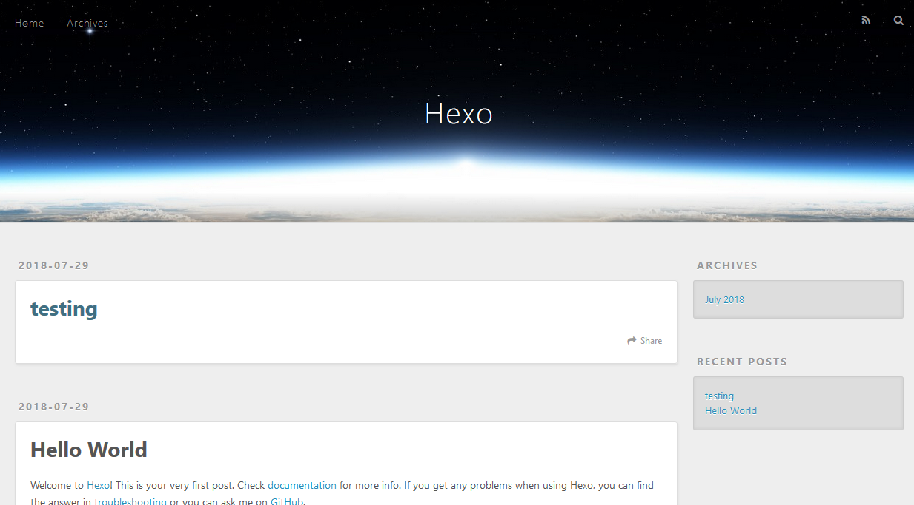

# 前言

博客已经不是什么很新鲜的玩意儿了，尤其是当微信公众号、简书等优秀的写作平台的兴起，个人博客的价值已经越来越式微了。但是作为一名软件研发行业的小学生，拥有个人博客记录一些日常所学、平日所感还是感觉不错的，一直以来我都是利用Hexo生成博客并托管到Github等开源平台。这期间还挺折腾的，主要表现在：

1. 博客的迁移，从github迁移到gitlab，然后是coding，然后又迁移到github；
2. 写过几篇文章，但是都感觉质量不高，而且很难坚持；
3. 托管到第三方网站，依赖别人必将受限于人。

因此这次痛下决心，自己购买了个阿里云服务器和域名，将hexo搭建的博客放在自己的服务器上，然后利用gitolite进行管理，nginx实现展示，下面分享给大家。

<!-- more -->

# 正题

### 安装

hexo是一个快速、简洁且高效的博客框架，它使用**Markdown**解析文章，执行生成命令即可得到靓丽的静态页面。安装hexo非常的简单。首先必须安装以下两款软件：

1. [Node.js](https://nodejs.org/en/)
2. [Git](https://git-scm.com/)

至于如何安装软件这里就不做介绍了，windows用户直接下载安装，mac及linux用户通过命令行就好了，请自行百度~

当Git和Node.js都安装完成后，windows用户请打开gitbash（git的命令行工具），mac、linux请打开命令行，执行

```
npm install -g hexo-cli
```

就完成了hexo的安装。

### 建站

安装hexo完成后，请执行下列命令，hexo将会在指定文件夹中新建所需要的文件。注：同样是在命令行下进行操作！

```
hexo init <folder> //hexo初始化folder文件夹
cd <folder>   //进入该文件夹
```

新建完成后，进入指定文件夹，我们会看到下列文件：

```
.
├── _config.yml //站点配置文件，比如配置主题等等
├── package.json 
├── scaffolds  //模板文件夹
├── source  //资源文件夹，新增的文章都会放在该文件夹中
|   ├── _drafts
|   └── _posts
└── themes  //主题文件夹
```

具体怎么配置以及修改主题请参考**[Hexo的官方文档](https://hexo.io/zh-cn/docs/)**

### 常用命令

```
hexo g //生成博客，是hexo generate的缩写
//执行完该命令，会在该目录下新增public文件夹，该文件夹就是最终的博客内容。
```

```
hexo s //预览博客，预览地址为http://localhost:4000/；是 hexo server的缩写
//执行该命令，会启动本地web服务，用户博客的预览
```

```
hexo d //发布博客到远端，如github等等，稍后会讲;是hexo deploy的缩写
```

```
hexo new post "testing" 
//新建testing的文章，在source的_post文件夹下会生成testing.md文件
```

那现在我们就来实践下：新增testing文章-->生成博客-->进行预览。

```
$ hexo new post "testing"
INFO  Created: ~\hello\source\_posts\testing.md
$ hexo g
INFO  Start processing
INFO  Files loaded in 319 ms
INFO  Generated: 2018/07/29/hello-world/index.html
INFO  Generated: archives/2018/index.html
INFO  Generated: index.html
INFO  Generated: archives/index.html
INFO  Generated: archives/2018/07/index.html
INFO  Generated: css/fonts/FontAwesome.otf
INFO  Generated: fancybox/fancybox_loading.gif
INFO  Generated: fancybox/blank.gif
INFO  Generated: fancybox/fancybox_overlay.png
INFO  Generated: fancybox/fancybox_sprite@2x.png
INFO  Generated: css/fonts/fontawesome-webfont.eot
INFO  Generated: fancybox/fancybox_loading@2x.gif
INFO  Generated: fancybox/helpers/fancybox_buttons.png
INFO  Generated: fancybox/fancybox_sprite.png
INFO  Generated: css/fonts/fontawesome-webfont.woff
INFO  Generated: css/fonts/fontawesome-webfont.ttf
INFO  Generated: fancybox/jquery.fancybox.css
INFO  Generated: 2018/07/29/testing/index.html
INFO  Generated: fancybox/helpers/jquery.fancybox-buttons.css
INFO  Generated: fancybox/helpers/jquery.fancybox-buttons.js
INFO  Generated: fancybox/helpers/jquery.fancybox-thumbs.css
INFO  Generated: js/script.js
INFO  Generated: css/style.css
INFO  Generated: fancybox/helpers/jquery.fancybox-media.js
INFO  Generated: fancybox/jquery.fancybox.js
INFO  Generated: fancybox/helpers/jquery.fancybox-thumbs.js
INFO  Generated: fancybox/jquery.fancybox.pack.js
INFO  Generated: css/fonts/fontawesome-webfont.svg
INFO  Generated: css/images/banner.jpg
INFO  29 files generated in 710 ms
$ hexo s
INFO  Start processing
INFO  Hexo is running at http://localhost:4000/. Press Ctrl+C to stop.
```

然后打开浏览器，输入http://localhost:4000/，你就可以看到你的博客了，如下图：



### 更换主题

是不是觉得上面的默认主题很一般？其实网上有很多hexo的主题，比如next，material等等，hexo theme里面收录了很多优秀的主题，地址如下：[Hexo Theme](https://hexo.io/themes/)

这里推荐几个常用的主题吧！

| 名称                                                        | 地址                                               |
| ----------------------------------------------------------- | -------------------------------------------------- |
| **[Anisina](https://github.com/haojen/hexo-theme-Anisina)** | https://github.com/Haojen/hexo-theme-Anisina       |
| **material**                                                | https://github.com/viosey/hexo-theme-material      |
| **next**                                                    | https://github.com/iissnan/hexo-theme-next         |
| **beantech**                                                | https://github.com/YenYuHsuan/hexo-theme-beantech/ |

其实每个主题的文档都会告诉用户如何去更换主题的，这里指针对next进行介绍。

首先你需要进入博客目录，然后执行下面的操作：

```
$ cd your-hexo-site
$ git clone https://github.com/iissnan/hexo-theme-next themes/next
//或者你可以直接将该主题从github下载下来，然后放到theme文件夹下，都是一样的。
```

那么在theme目录中就存在next的文件夹了，也就是我们的主题；接下来只需要修改博客的根目录的_config.yml文件并进行如下修改：

```
theme: next//找到theme关键字，讲landscape改成next即可
```

至此利用hexo搭建博客，修改主题已经完成了，剩下的就是写文章，不断的丰富博客的内容了。

## 预告

接下来的一篇文章会介绍，如何利用个人Git服务器管理博客源文件和博客最终文件，并利用nginx作为web服务器显示博客并进行自动更新~ 

精彩内容，不容错过！！！！！