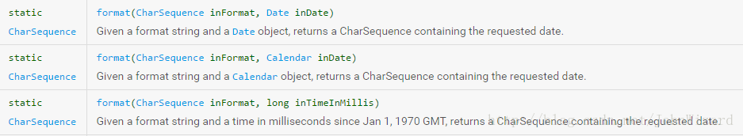
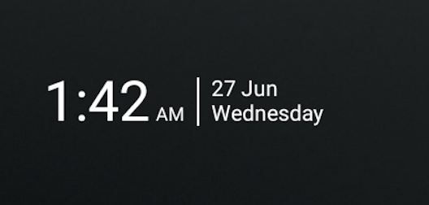

# 前言

各位大佬好，小弟最近做了一款安卓机顶盒的主页。因为是针对电视的主页，一般来说需要显示系统时间。糟糕的是，我在Android Studio里面我没有找到对应显示时间的控件，参考以前同事写的代码后采用了以下解决方案：**利用定时器，每秒取一次系统时间，然后格式化并显示在TextView上。**显然这种方式是不行的，那我们该怎么做呢？

# 正题

显然采用上面的解决方案能够解决问题，但是每秒都去新建Date对象，然后格式化成String肯定是很不行的。首先是定时器，其次便是每秒新增对象，就像个死循环一样，非常的消耗资源。于是通过查询网页和咨询网友，终于找到了比较好的解决方案，它就是我们的主角：**TextClock**！

在我们介绍TextClock之前，我们必须要先介绍下*DateFormat*和*日期时间模式字符串*

## DateFormat

**DateFormat**是用来格式化时间的，因为我们new出来的Date对象其实是个String类型的时间戳，而且每个用户需要显示的时间样式也不一样（根据时区），因此我们必须采用DateFormat对时间进行格式化。让我们来看下它的format方法：



从第一个格式化方法我们不难看出，他需要两个参数，第二个就是我们的Date对象。那么第一个呢？其实就是我们需要如何显示时间的模式字符串。

## 时间模式字符串

在*date and time pattern strings*中，**未被单引号引用的字母从’A’ to ‘Z’和’a’ to ‘z’被解释为模式字母，代表着日期和时间的字符串**，**其他的字母或符号在格式化时只被单纯的复制而不进行解释。**

模式字母的定义如下图：

| 字母 | 含义                       | 表示                                  |
| ---- | -------------------------- | ------------------------------------- |
| y    | 年                         | Year                                  |
| M    | 年份中的月                 | Month                                 |
| w    | 年中的周                   | number                                |
| W    | 月中的周                   | number                                |
| D    | 年中的天                   | number                                |
| d    | 月中的天                   | number                                |
| F    | 月中星期                   | number                                |
| E    | 周                         | Tuesday                               |
| a    | AM/PM                      | 上午下午                              |
| H    | 小时数（0-23）             | number                                |
| k    | 小时数                     | number                                |
| K    | 12小时中的小时数（0-11）   | number                                |
| h    | 12小时制中的小时数（1-12） | number                                |
| m    | 分钟                       | number                                |
| s    | 秒数                       | number                                |
| S    | 毫秒数                     | number                                |
| z    | General time zone 时区     | Pacific Standard Time; PST; GMT-08:00 |
| Z    | RFC 822 time zone 时区     | -0800                                 |
|      |                            |                                       |

***举例子***

| Date and Time Pattern | Result              | 备注 |
| --------------------- | ------------------- | ---- |
| yyyy-MM-dd            | 2018-08-04          |      |
| EEE, MM d             | Wed, Jul 4          |      |
| HH:mm a               | 12:21 AM            |      |
| yyyy:MM:dd HH:mm:ss   | 2018:08:04 10:21:23 |      |

## TextClock

好啦，说完了以上两个概念，现在我们具体来看看如何使用TextClock！

首先就当成普通的控件在布局文件中直接使用，如：

```
<TextClock
          android:id="@+id/timeView"
          android:layout_width="wrap_content"
          android:layout_height="wrap_content"
          android:layout_centerVertical="true"
          android:layout_gravity="center"
          android:layout_toStartOf="@+id/dataView"
          android:format24Hour ="HH:mm"
          android:format12Hour ="hh:mm"
          android:textColor="@color/material_white"
          android:textSize="@dimen/w_56" />
```

与其他控件不同的是，TextClock有几个特别的属性，根据这些属性能够显示特定格式的时间。具体如下：

| XML属性              | 相关方法                      | 说明                     |
| -------------------- | ----------------------------- | ------------------------ |
| android:format12Hour | setFormat12Hour(CharSequence) | 设置12小时制的格式字符串 |
| android:format24Hour | setFormat12Hour(CharSequence) | 设置24小时制的格式字符串 |
| android:timeZone     | setTimeZone(String)           | 设置该时钟的时区         |

有时候为了同时支持24小时制和12小时制，建议上面的前两个属性都需要加上！

多学习、多实践以上内容后，用TextClock实现下面的布局就变得非常的容易，加油吧！！！！

